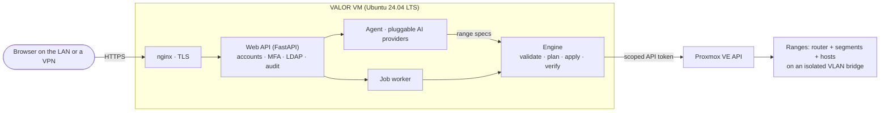

# VALOR roadmap

From the Claude Code MVP to a product you install on **any Proxmox VE cluster** and use from a browser.
Target: **Spring 2027** (Champlain College capstone). Tracked here and as
[GitHub milestones and issues](https://github.com/Dleifnesor/valor/milestones).

## How VALOR will be used

```bash
# On any Proxmox VE node, as root
git clone https://github.com/Dleifnesor/valor && cd valor
./install.sh                      # or unattended: ./install.sh --answers my-cluster.toml
```

1. The installer checks the node and discovers its storage, networks, free VMIDs and VLANs. It asks only what it
   cannot decide, and always suggests a detected default.
2. It creates a least-privilege API identity, an isolated range network, verified OS templates and the
   **VALOR VM**.
3. You open `https://<valor-vm>` from the LAN or a VPN and sign in with MFA.
4. You describe an environment in the chat. The agent drafts it and the topology map shows what will be added or
   changed. After you approve, the engine builds and verifies it.

Claude Code in this repository is for *developing* VALOR, not for using it.

## Principles

| Principle | What it means |
|---|---|
| **Any Proxmox cluster** | Nothing about a particular cluster is hard-coded. The installer discovers nodes, storage, bridges, networks, free VMIDs/VLANs and CPU features. Every answer can come from an answers file, so an install can be repeated exactly. A freshly installed, nested Proxmox VE is the portability test. |
| **The agent plans, the engine executes** | The AI only writes and changes range specs. A deterministic engine is the only component that calls the Proxmox API. |
| **Least privilege** | One privilege-separated API token, scoped to VALOR's pools, storage and bridges. It cannot touch the VALOR VM itself or anything else on the cluster. |
| **A human approves every change** | Every build and every destroy waits for a click on the exact plan shown. |
| **LAN + VPN only** | The web UI is never exposed to the internet. |
| **Reproducible** | Specs are versioned and hashed, applies are idempotent, images are signature-checked and dependencies are hash-pinned. |
| **Honest compliance** | Results are "aligned with" a framework's themes, never "compliant" or "certified". |

## Decisions (3 October 2026)

| Area | Decision |
|---|---|
| Installation | The installer runs from a Proxmox node shell and creates its own VALOR VM, which manages the cluster through the Proxmox API. |
| Web UI | React + React Flow. Reachable from the LAN and VPNs only. TLS is chosen at install: VALOR's own CA, your own certificate, or ACME DNS-01. |
| Topology map | Editable since 4 Oct 2026 (was view-only): add/remove VMs and services on the map and from a chat panel (Question / Plan / Code modes, kept per range). Edits form a draft shown in the plan colors; nothing is built until someone approves the plan. |
| Users | Individuals, teams, classrooms and multiple organizations. Quotas plus reserved VLAN/IP ranges per organization. |
| Sign-in | Local accounts with MFA, and LDAP/Active Directory. |
| AI | Pluggable providers, a strong + fast model mix, a usage dashboard (no hard caps). |
| Approvals | Every build and every destroy. |
| Access to ranges | Browser consoles with approval, a WireGuard VPN per range. |
| Platforms | Windows Server + AD and Windows 10/11 (evaluation ISOs or uploads), firewall appliances, more Linux. |
| Scale and lifecycle | Multiple nodes through Proxmox SDN, snapshots and reset, per-student copies, auto-expiry and power schedules. |
| Secrets | Vaultwarden/Bitwarden. |
| Compliance | One skill/context file per framework: CIS, NIST SP 800-171, NIST SP 800-53, DISA STIGs, ISO/IEC 27001. |
| Notifications | Email, Discord, Slack/Teams and in-app, configured in the web UI. |
| Evaluation | H1-H4 metrics dashboard built in, plus the 10-prompt test suite. |
| Repository | Private for now; the license is chosen before it goes public. |

## Target architecture



## Milestones

✅ done · 🚧 in progress · ⬜ planned

### M0 · MVP ✅ (2 October 2026)

Claude Code + MCP server + engine on the development cluster. Three reference ranges were built and verified with
every isolation and baseline check passing. Rebuilds produced identical plans, and re-applying an unchanged spec
made zero changes. See the [README](README.md).

### M1 · Installer, VALOR VM and secure web UI 🚧 (due 20 Nov 2026)

One command in a Proxmox node shell gives a hardened VALOR VM with a secure web UI.

| Issue | Goal |
|---|---|
| [#1](https://github.com/Dleifnesor/valor/issues/1) Installer: one command from a Proxmox node shell | Installs end to end with defaults it detects itself; answers file; dry run |
| [#2](https://github.com/Dleifnesor/valor/issues/2) Installer: least-privilege Proxmox identity | Exactly the rights VALOR needs, adapted to the PVE version |
| [#3](https://github.com/Dleifnesor/valor/issues/3) Installer: isolated range network | Port-less VLAN bridge with backup and automatic rollback |
| [#4](https://github.com/Dleifnesor/valor/issues/4) Installer: verified OS templates | Signature-checked images, found by tag, CPU type per node |
| [#5](https://github.com/Dleifnesor/valor/issues/5) VALOR VM: appliance build and provisioning | Provisioned over the guest agent; hash-pinned dependencies |
| [#6](https://github.com/Dleifnesor/valor/issues/6) VALOR VM: hardening, LAN + VPN only | Default-deny firewall, hardened services, security headers |
| [#7](https://github.com/Dleifnesor/valor/issues/7) TLS chosen at install | VALOR CA, your own certificate, or ACME DNS-01 |
| [#8](https://github.com/Dleifnesor/valor/issues/8) Web backend: API service, database and job worker | FastAPI + SQLite; builds survive web restarts |
| [#9](https://github.com/Dleifnesor/valor/issues/9) Local accounts with mandatory MFA | Argon2id, TOTP, recovery codes, CSRF, lockout |
| [#10](https://github.com/Dleifnesor/valor/issues/10) LDAP / Active Directory sign-in | Group-to-role mapping; MFA still required |
| [#11](https://github.com/Dleifnesor/valor/issues/11) Web UI shell (React) | Sign-in, dashboard, ranges, jobs, users, audit, settings |
| [#12](https://github.com/Dleifnesor/valor/issues/12) Health page | Can VALOR do its job right now? |
| [#13](https://github.com/Dleifnesor/valor/issues/13) Notification settings in the web UI | Email, Discord, Slack, Teams, in-app |
| [#14](https://github.com/Dleifnesor/valor/issues/14) Upgrade and uninstall | Keep data on upgrade; clean removal |
| [#15](https://github.com/Dleifnesor/valor/issues/15) Range internet uplink without LAN DHCP | NAT transit through the VALOR VM |
| [#16](https://github.com/Dleifnesor/valor/issues/16) Engine: remove cluster-specific defaults | Everything from the installer-written config |
| [#17](https://github.com/Dleifnesor/valor/issues/17) Portability test: fresh nested Proxmox VE | Unattended install on a Proxmox VE VALOR has never seen — ✅ passed 4 Oct 2026: fresh nested Proxmox VE 9.2 on an isolated 10.0.0.0/24 test network; install + first range verified (5/5, 3/3, 29/29) |
| [#18](https://github.com/Dleifnesor/valor/issues/18) Docs: install guide and answers-file reference | Someone new can install it |

### M2 · Chat builder and topology map 🚧 (due 18 Dec 2026)

Describe, see, approve, watch, review.

| Issue | Goal |
|---|---|
| [#19](https://github.com/Dleifnesor/valor/issues/19) Agent service with pluggable AI providers | Anthropic, OpenAI-compatible, local models; strong + fast mix — ✅ Anthropic + OpenAI-compatible, key encrypted (live test waits for a provider key) |
| [#20](https://github.com/Dleifnesor/valor/issues/20) Chat environment builder | Conversation -> range spec -> plan, refined iteratively — ✅ validate-and-fix loop, map preview, hand-off to plan → approve |
| [#21](https://github.com/Dleifnesor/valor/issues/21) Plan approval for every build and destroy | The approved plan hash is the one that runs |
| [#22](https://github.com/Dleifnesor/valor/issues/22) Topology map (React Flow), view-only | Router, segments, hosts and allowed flows |
| [#23](https://github.com/Dleifnesor/valor/issues/23) Change overlay on the topology map | Create / update / replace / remove in color |
| [#24](https://github.com/Dleifnesor/valor/issues/24) Live build progress | Streamed job events |
| [#25](https://github.com/Dleifnesor/valor/issues/25) Results and journal views | Verification matrix, baseline, history |
| [#26](https://github.com/Dleifnesor/valor/issues/26) AI usage dashboard | Tokens and cost per user, model, range — 🚧 tokens per user and day, daily budgets; cost per model/range to do |
| [#27](https://github.com/Dleifnesor/valor/issues/27) H1-H4 metrics dashboard and the 10-prompt test suite | Evaluation built into the product |
| [#28](https://github.com/Dleifnesor/valor/issues/28) Agent knowledge: skills inside the appliance | The development skills, shipped with releases |

### M3 · Tenancy, secrets and access 🚧 (due 29 Jan 2027)

| Issue | Goal |
|---|---|
| [#29](https://github.com/Dleifnesor/valor/issues/29) Organizations, classes and roles | Admin, instructor, operator, student, viewer |
| [#30](https://github.com/Dleifnesor/valor/issues/30) Quotas and reserved ranges per organization | Limits plus reserved VLAN/IP blocks |
| [#31](https://github.com/Dleifnesor/valor/issues/31) Secrets in Vaultwarden/Bitwarden | No passwords in specs or chat logs |
| [#32](https://github.com/Dleifnesor/valor/issues/32) Browser consoles with approval | Proxied; Proxmox never exposed — ✅ noVNC + serial in the browser for operators/admins, audited (no per-session approval, by decision) |
| [#33](https://github.com/Dleifnesor/valor/issues/33) WireGuard VPN per range | Per-user configs with QR codes — ✅ keys encrypted, QR codes, live status, per-peer rotation, isolation tested |
| [#34](https://github.com/Dleifnesor/valor/issues/34) Approval policies | Who may approve; optional two-person rule |

### M4 · Windows, firewalls and more Linux 🚧 (due 26 Feb 2027)

| Issue | Goal |
|---|---|
| [#35](https://github.com/Dleifnesor/valor/issues/35) Windows Server and Active Directory | Redundant DCs, DNS, DHCP, member join — 🚧 forest + replica DC (2022/2025 Core), member join, IIS done and verified (8/8, baseline 46/46); a DHCP role is still to do |
| [#36](https://github.com/Dleifnesor/valor/issues/36) Windows 10/11 clients | UEFI + TPM, domain join — ✅ Windows 11 (current evaluation) template; UEFI + TPM 2.0 |
| [#37](https://github.com/Dleifnesor/valor/issues/37) Firewall appliances with several NICs | VyOS, pfSense, OPNsense |
| [#39](https://github.com/Dleifnesor/valor/issues/39) More Linux distributions | Kali, Rocky, Alma, Security Onion — 🚧 Kali, Rocky 10, Alma 10 done (cloud images + Rocky/Alma ISO installs); Security Onion to do |
| [#40](https://github.com/Dleifnesor/valor/issues/40) Template manager in the web UI | Builds, uploads, evaluation ISOs |
| [#41](https://github.com/Dleifnesor/valor/issues/41) Roles and baselines for non-apt systems | dnf, Windows — ✅ dnf (Rocky/Alma) and PowerShell roles + windows-l1 baseline |

### M5 · Multi-node and range lifecycle 🚧 (due 26 Mar 2027)

| Issue | Goal |
|---|---|
| [#42](https://github.com/Dleifnesor/valor/issues/42) Multi-node ranges via Proxmox SDN | VXLAN, no switch configuration |
| [#43](https://github.com/Dleifnesor/valor/issues/43) Snapshots and one-click reset | Back to known-good in seconds — ✅ automatic valor-clean after each verified build, reset with re-verification |
| [#44](https://github.com/Dleifnesor/valor/issues/44) Per-student copies | Bulk create/reset/destroy for a class — ✅ blueprints: numbered or per-student copies with their own VLANs, networks and WireGuard peer |
| [#45](https://github.com/Dleifnesor/valor/issues/45) Auto-expiry and power schedules | No forgotten ranges |
| [#46](https://github.com/Dleifnesor/valor/issues/46) Backup and restore | Survive the loss of the VALOR VM |
| [#47](https://github.com/Dleifnesor/valor/issues/47) Proxmox API failover | Keep working with a node down |

### M6 · Compliance, evaluation and release ⬜ (due 23 Apr 2027)

| Issue | Goal |
|---|---|
| [#48](https://github.com/Dleifnesor/valor/issues/48) Compliance framework skills | CIS, NIST 800-171/800-53, DISA STIGs, ISO 27001 |
| [#49](https://github.com/Dleifnesor/valor/issues/49) Compliance reports | Evidence with "aligned with" wording |
| [#50](https://github.com/Dleifnesor/valor/issues/50) Evaluation runs and capstone write-up | H1-H4 on the finished product |
| [#51](https://github.com/Dleifnesor/valor/issues/51) Release packaging and license | Signed, checksummed releases |
| [#52](https://github.com/Dleifnesor/valor/issues/52) Security review | Threat model, audits, ASVS L2 test — 🚧 route-level access, CSRF/origin and header tests; live port/TLS checks |

## Open questions

- **Vaultwarden**: run it inside VALOR, connect to an existing server, or support both. Decide in M3
  ([#31](https://github.com/Dleifnesor/valor/issues/31)).
- **Licensed frameworks**: CIS Benchmarks and ISO/IEC 27001 texts are licensed, so their skills reference control
  IDs and themes only ([#48](https://github.com/Dleifnesor/valor/issues/48)).
- **License** for the public release ([#51](https://github.com/Dleifnesor/valor/issues/51)).

## Not planned

- Exposing VALOR to the internet.
- Hypervisors other than Proxmox VE.
