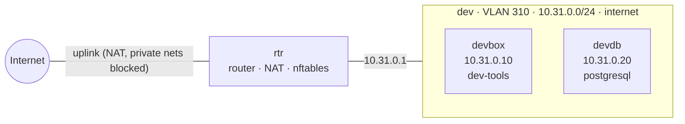

# Range `devenv`

> Reference range 3: single-segment development environment with internet access - a Debian 13 developer workstation and an Ubuntu PostgreSQL server for it.

| | |
|---|---|
| Spec | `devenv.yaml` · version `a06300a01dcf` |
| Last apply | 2026-10-02T23:33:47-0400 · OK · 198.4 s |
| Last verification | 2026-10-02T23:37:08-0400 · PASS · tests 2/2 · baseline 29/29 |
| Baseline | `ubuntu-l1` (results are *aligned with* the baseline's themes, not a certification) |
| Generated | 2026-10-02 23:37 EDT by the VALOR engine |

## Topology

## Hosts

| Host | Segment | Address | OS | vCPU / RAM / disk | Services | VMID | State |
|---|---|---|---|---|---|---|---|
| rtr (router) | all | uplink DHCP; 10.31.0.1 | ubuntu-24.04 | 1 / 1024 MiB / 10 GiB | routing, NAT, policy | 4007 | running |
| devbox | dev | 10.31.0.10 | debian-13 | 2 / 2048 MiB / 20 GiB | dev-tools | 4008 | running |
| devdb | dev | 10.31.0.20 | ubuntu-24.04 | 1 / 1024 MiB / 10 GiB | postgresql | 4009 | running |

## Network

| Segment | VLAN | Network | Gateway | Internet egress |
|---|---|---|---|---|
| dev | 310 | 10.31.0.0/24 | 10.31.0.1 | yes (public addresses only) |

## Traffic policy

Everything between segments is **denied** unless listed here. Internet egress never reaches private addresses (home LAN, cluster network).

| From | To | Protocol | Ports | Note |
|---|---|---|---|---|
| - | - | - | - | no inter-segment traffic allowed |

## Verification

**PASS** · tests 2/2 · isolation 0/0 · baseline controls 29/29 · 2.0 s

| Test | From | Target | Expect | Observed | Result |
|---|---|---|---|---|---|
| workstation reaches the database | devbox | 10.31.0.20:5432 | open | open (connected) | ✅ |
| workstation has internet | devbox | 1.1.1.1:443 | open | open (connected) | ✅ |

Baseline controls per host (✅ pass · ❌ fail · – not applicable):

| Control | Area | rtr | devbox | devdb |
|---|---|---|---|---|
| SSH root login disabled | SSH | ✅ | ✅ | ✅ |
| SSH password authentication disabled | SSH | ✅ | ✅ | ✅ |
| SSH authentication attempts limited (4 or fewer) | SSH | ✅ | ✅ | ✅ |
| SSH server configuration files owned by root, not readable by others | SSH | ✅ | ✅ | ✅ |
| Full address space layout randomization (kernel.randomize_va_space = 2) | Kernel | ✅ | ✅ | ✅ |
| Core dumps of setuid programs disabled (fs.suid_dumpable = 0) | Kernel | ✅ | ✅ | ✅ |
| auditd installed, enabled and running | Auditing | ✅ | ✅ | ✅ |
| Automatic security updates installed and enabled | Patching | ✅ | ✅ | ✅ |
| /tmp is world-writable only with the sticky bit set (mode 1777) | Filesystem | ✅ | ✅ | ✅ |
| IP forwarding disabled (not a router) | Kernel | – | ✅ | ✅ |

## Build history, issues and fixes

| When | Action | Result | Duration | Details |
|---|---|---|---|---|
| 2026-10-02T23:33:47-0400 | apply | OK | 198.4 s | changes applied |
| 2026-10-02T23:33:47-0400 | verify | OK | 2.0 s |  |

<!-- Agent notes: add a short 'Fix:' line under an issue when you resolve it; keep this marker. -->
