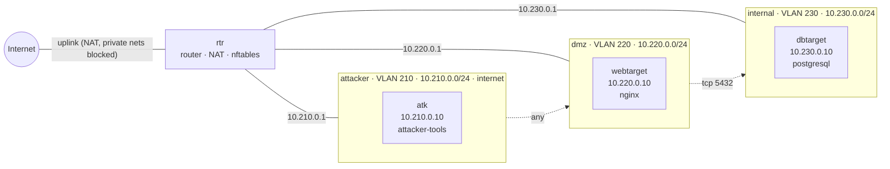

# Range `pentest`

> Reference range 2: three-segment penetration-testing lab. An attacker segment with a toolbox host may probe the DMZ on any port; the DMZ web target may reach the internal database on TCP 5432 only; nothing can reach the attacker segment; only the attacker segment has internet access.

| | |
|---|---|
| Spec | `pentest.yaml` · version `dfec51508ec5` |
| Last apply | 2026-10-02T23:47:18-0400 · OK · 0.4 s |
| Last verification | 2026-10-02T23:33:37-0400 · PASS · tests 12/12 · baseline 39/39 |
| Baseline | `ubuntu-l1` (results are *aligned with* the baseline's themes, not a certification) |
| Generated | 2026-10-02 23:47 EDT by the VALOR engine |

## Topology

## Hosts

| Host | Segment | Address | OS | vCPU / RAM / disk | Services | VMID | State |
|---|---|---|---|---|---|---|---|
| rtr (router) | all | uplink DHCP; 10.210.0.1, 10.220.0.1, 10.230.0.1 | ubuntu-24.04 | 1 / 1024 MiB / 10 GiB | routing, NAT, policy | 4003 | running |
| atk | attacker | 10.210.0.10 | ubuntu-24.04 | 1 / 2048 MiB / 10 GiB | attacker-tools | 4004 | running |
| webtarget | dmz | 10.220.0.10 | ubuntu-24.04 | 1 / 1024 MiB / 10 GiB | nginx | 4005 | running |
| dbtarget | internal | 10.230.0.10 | ubuntu-24.04 | 1 / 2048 MiB / 10 GiB | postgresql | 4006 | running |

## Network

| Segment | VLAN | Network | Gateway | Internet egress |
|---|---|---|---|---|
| attacker | 210 | 10.210.0.0/24 | 10.210.0.1 | yes (public addresses only) |
| dmz | 220 | 10.220.0.0/24 | 10.220.0.1 | no |
| internal | 230 | 10.230.0.0/24 | 10.230.0.1 | no |

## Traffic policy

Everything between segments is **denied** unless listed here. Internet egress never reaches private addresses (home LAN, cluster network).

| From | To | Protocol | Ports | Note |
|---|---|---|---|---|
| attacker | dmz | any | - | attacker may probe the DMZ on any port |
| dmz | internal | tcp | 5432 | web target to its database |

## Verification

**PASS** · tests 12/12 · isolation 8/8 · baseline controls 39/39 · 24.9 s

| Test | From | Target | Expect | Observed | Result |
|---|---|---|---|---|---|
| attacker reaches the web target | atk | 10.220.0.10:80 | open | open (connected) | ✅ |
| attacker reaches SSH in the DMZ | atk | 10.220.0.10:22 | open | open (connected) | ✅ |
| attacker cannot reach the database | atk | 10.230.0.10:5432 | closed | closed (filtered (timed out)) | ✅ |
| isolation: atk (attacker) -> dbtarget (internal) tcp/22 blocked | atk | 10.230.0.10:22 | closed | closed (filtered (timed out)) | ✅ |
| egress: attacker internet allowed | atk | 1.1.1.1:443 | open | open (connected) | ✅ |
| web target reaches its database | webtarget | 10.230.0.10:5432 | open | open (connected) | ✅ |
| DMZ cannot reach the attacker | webtarget | 10.210.0.10:22 | closed | closed (filtered (timed out)) | ✅ |
| isolation: webtarget (dmz) -> dbtarget (internal) tcp/22 blocked | webtarget | 10.230.0.10:22 | closed | closed (filtered (timed out)) | ✅ |
| egress: dmz internet blocked | webtarget | 1.1.1.1:443 | closed | closed (filtered (timed out)) | ✅ |
| isolation: dbtarget (internal) -> atk (attacker) tcp/22 blocked | dbtarget | 10.210.0.10:22 | closed | closed (filtered (timed out)) | ✅ |
| isolation: dbtarget (internal) -> webtarget (dmz) tcp/22 blocked | dbtarget | 10.220.0.10:22 | closed | closed (filtered (timed out)) | ✅ |
| egress: internal internet blocked | dbtarget | 1.1.1.1:443 | closed | closed (filtered (timed out)) | ✅ |

Baseline controls per host (✅ pass · ❌ fail · – not applicable):

| Control | Area | rtr | atk | webtarget | dbtarget |
|---|---|---|---|---|---|
| SSH root login disabled | SSH | ✅ | ✅ | ✅ | ✅ |
| SSH password authentication disabled | SSH | ✅ | ✅ | ✅ | ✅ |
| SSH authentication attempts limited (4 or fewer) | SSH | ✅ | ✅ | ✅ | ✅ |
| SSH server configuration files owned by root, not readable by others | SSH | ✅ | ✅ | ✅ | ✅ |
| Full address space layout randomization (kernel.randomize_va_space = 2) | Kernel | ✅ | ✅ | ✅ | ✅ |
| Core dumps of setuid programs disabled (fs.suid_dumpable = 0) | Kernel | ✅ | ✅ | ✅ | ✅ |
| auditd installed, enabled and running | Auditing | ✅ | ✅ | ✅ | ✅ |
| Automatic security updates installed and enabled | Patching | ✅ | ✅ | ✅ | ✅ |
| /tmp is world-writable only with the sticky bit set (mode 1777) | Filesystem | ✅ | ✅ | ✅ | ✅ |
| IP forwarding disabled (not a router) | Kernel | – | ✅ | ✅ | ✅ |

## Build history, issues and fixes

| When | Action | Result | Duration | Details |
|---|---|---|---|---|
| 2026-10-02T23:30:33-0400 | apply | OK | 159.1 s | changes applied |
| 2026-10-02T23:30:33-0400 | verify | OK | 24.9 s |  |
| 2026-10-02T23:47:18-0400 | apply | OK | 0.4 s | no changes |

<!-- Agent notes: add a short 'Fix:' line under an issue when you resolve it; keep this marker. -->
