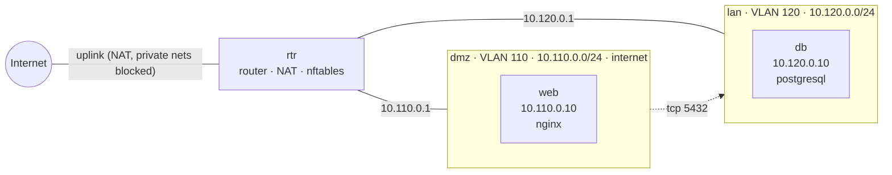

# Range `web2tier`

> Reference range 1 (MVP spec 6.1): a DMZ with an nginx web server that has internet access, and an isolated LAN running PostgreSQL that only the web server can reach, on TCP 5432.

| | |
|---|---|
| Spec | `web2tier.yaml` · version `b3ebb031dbd8` |
| Last apply | 2026-10-02T23:46:58-0400 · OK · 0.4 s |
| Last verification | 2026-10-02T23:46:58-0400 · PASS · tests 6/6 · baseline 29/29 |
| Baseline | `ubuntu-l1` (results are *aligned with* the baseline's themes, not a certification) |
| Generated | 2026-10-02 23:46 EDT by the VALOR engine |

## Topology

## Hosts

| Host | Segment | Address | OS | vCPU / RAM / disk | Services | VMID | State |
|---|---|---|---|---|---|---|---|
| rtr (router) | all | uplink DHCP; 10.110.0.1, 10.120.0.1 | ubuntu-24.04 | 1 / 1024 MiB / 10 GiB | routing, NAT, policy | 4000 | running |
| web | dmz | 10.110.0.10 | ubuntu-24.04 | 1 / 1024 MiB / 10 GiB | nginx | 4001 | running |
| db | lan | 10.120.0.10 | ubuntu-24.04 | 1 / 2048 MiB / 10 GiB | postgresql | 4002 | running |

## Network

| Segment | VLAN | Network | Gateway | Internet egress |
|---|---|---|---|---|
| dmz | 110 | 10.110.0.0/24 | 10.110.0.1 | yes (public addresses only) |
| lan | 120 | 10.120.0.0/24 | 10.120.0.1 | no |

## Traffic policy

Everything between segments is **denied** unless listed here. Internet egress never reaches private addresses (home LAN, cluster network).

| From | To | Protocol | Ports | Note |
|---|---|---|---|---|
| dmz | lan | tcp | 5432 | web tier to database |

## Verification

**PASS** · tests 6/6 · isolation 4/4 · baseline controls 29/29 · 24.7 s

| Test | From | Target | Expect | Observed | Result |
|---|---|---|---|---|---|
| web reaches db on 5432 | web | 10.120.0.10:5432 | open | open (connected) | ✅ |
| web cannot reach db on SSH | web | 10.120.0.10:22 | closed | closed (filtered (timed out)) | ✅ |
| egress: dmz internet allowed | web | 1.1.1.1:443 | open | open (connected) | ✅ |
| db cannot reach web | db | 10.110.0.10:80 | closed | closed (filtered (timed out)) | ✅ |
| isolation: db (lan) -> web (dmz) tcp/22 blocked | db | 10.110.0.10:22 | closed | closed (filtered (timed out)) | ✅ |
| egress: lan internet blocked | db | 1.1.1.1:443 | closed | closed (filtered (timed out)) | ✅ |

Baseline controls per host (✅ pass · ❌ fail · – not applicable):

| Control | Area | rtr | web | db |
|---|---|---|---|---|
| SSH root login disabled | SSH | ✅ | ✅ | ✅ |
| SSH password authentication disabled | SSH | ✅ | ✅ | ✅ |
| SSH authentication attempts limited (4 or fewer) | SSH | ✅ | ✅ | ✅ |
| SSH server configuration files owned by root, not readable by others | SSH | ✅ | ✅ | ✅ |
| Full address space layout randomization (kernel.randomize_va_space = 2) | Kernel | ✅ | ✅ | ✅ |
| Core dumps of setuid programs disabled (fs.suid_dumpable = 0) | Kernel | ✅ | ✅ | ✅ |
| auditd installed, enabled and running | Auditing | ✅ | ✅ | ✅ |
| Automatic security updates installed and enabled | Patching | ✅ | ✅ | ✅ |
| /tmp is world-writable only with the sticky bit set (mode 1777) | Filesystem | ✅ | ✅ | ✅ |
| IP forwarding disabled (not a router) | Kernel | – | ✅ | ✅ |

## Build history, issues and fixes

| When | Action | Result | Duration | Details |
|---|---|---|---|---|
| 2026-10-02T23:19:29-0400 | apply | FAILED | - s | baseline_failed: baseline controls failed on web: ssh-root-login, ssh-password-auth, ssh-max-auth-tries |
| 2026-10-02T23:22:34-0400 | apply | FAILED | - s | baseline_failed: baseline controls failed on web: ssh-password-auth |
| 2026-10-02T23:24:02-0400 | apply | FAILED | - s | baseline_failed: baseline controls failed on db: script error |
| 2026-10-02T23:24:28-0400 | apply | OK | 53.7 s | changes applied |
| 2026-10-02T23:24:28-0400 | verify | OK | 24.5 s |  |
| 2026-10-02T23:26:00-0400 | apply | OK | 0.4 s | no changes |
| 2026-10-02T23:26:12-0400 | destroy | OK | 10.9 s |  |
| 2026-10-02T23:26:23-0400 | apply | OK | 146.6 s | changes applied |
| 2026-10-02T23:26:23-0400 | verify | OK | 24.9 s |  |
| 2026-10-02T23:37:54-0400 | destroy | OK | 9.4 s |  |
| 2026-10-02T23:38:05-0400 | apply | OK | 144.5 s | changes applied |
| 2026-10-02T23:38:05-0400 | verify | OK | 24.7 s |  |
| 2026-10-02T23:40:54-0400 | apply | OK | 0.4 s | no changes |
| 2026-10-02T23:40:56-0400 | destroy | OK | 9.4 s |  |
| 2026-10-02T23:41:06-0400 | apply | OK | 144.1 s | changes applied |
| 2026-10-02T23:41:06-0400 | verify | OK | 24.5 s |  |
| 2026-10-02T23:43:55-0400 | apply | OK | 0.4 s | no changes |
| 2026-10-02T23:43:56-0400 | destroy | OK | 9.4 s |  |
| 2026-10-02T23:44:07-0400 | apply | OK | 146.2 s | changes applied |
| 2026-10-02T23:44:07-0400 | verify | OK | 24.7 s |  |
| 2026-10-02T23:46:58-0400 | apply | OK | 0.4 s | no changes |

<!-- Agent notes: add a short 'Fix:' line under an issue when you resolve it; keep this marker. -->
